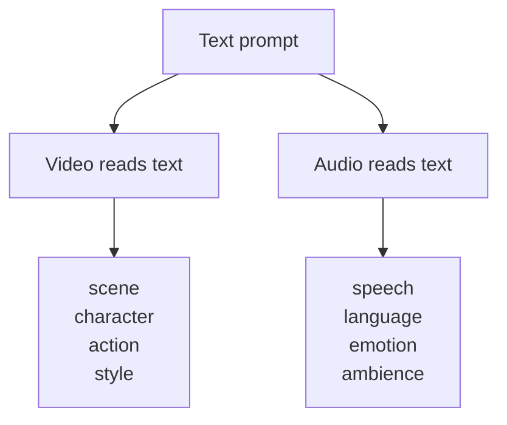
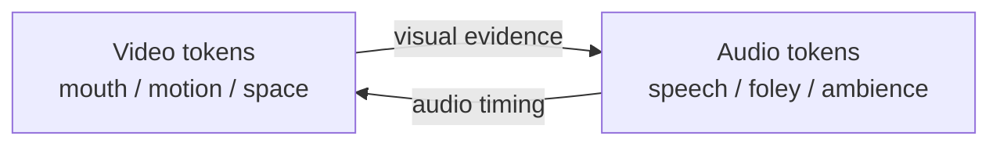

# LTX-2：联合音视频生成的最小心智模型

先抓住这篇论文真正要解决的矛盾：视频和音频经常来自同一个事件，但它们不是同一种信号。

如果先生成视频再补音频，声音只能给既定画面“配合”。如果先生成音频再补视频，画面又只能倒推声音背后的场景。LTX-2 想做的，是让声音和画面一起生成同一个事件，不把音频留到最后再补。

这句话是整篇的主轴：**关键在共同生成同一个事件，不在后配音。**

## 第一个问题：为什么不能后配音？

因为很多声画关系不是后期能轻松补上的。

一个人说话时，嘴型受发音约束。玻璃碎裂时，声音要和碎裂时刻对上。车从左向右开过时，画面里的运动和声音的空间变化要一起发生。空旷车库里的说话声，还应该带着空间混响。

这些不是“视频 + 一条声音轨”。它们更像同一个物理事件在两个感官里的投影。

串联式方案是：

```text
video first -> audio later
```

LTX-2 要学的是：

```text
text -> generate video and audio together
```

更正式一点，它想学的是 `p(video, audio | text)`，也就是在文本条件下，视频和音频的联合分布。

这打开了下一个问题：既然要联合生成，为什么不把音频和视频塞进同一个表示里？

## 第二个问题：为什么先分开表示？

因为“联合”不等于“混成一种东西”。

视频是 3D 时空信号：有横向、纵向、时间，还要处理物体、纹理、运动、镜头。音频更像 1D 时间信号：重点是节奏、频率、语音、环境声。

如果硬塞进同一个 latent，位置编码、压缩率、模型容量都会变别扭。LTX-2 的做法更克制：

- 视频进自己的 video VAE，变成 video latent。
- 音频进自己的 audio VAE，变成 audio latent。
- 视频流更大，音频流更小，因为视频的信息密度通常更高。

也就是说，它没有追求一个“大一统潜空间”。相反，它先让两种模态保留各自合适的表示。

但问题还没有结束。分开之后，怎么避免它们各生成各的？

答案是：**表示分开，生成过程耦合。**

## 第三个问题：每一层到底在做什么？

LTX-2 的核心是一个不对称双流 Diffusion Transformer。你可以把它想成两条并行的生成流：一条管视频，一条管音频。每一层里，两条流都按相似顺序工作。


这张图只回答一个问题：一层里先后发生什么。

- **self-attention**：我现在生成到什么状态了？
- **text cross-attention**：prompt 要我往哪里去？
- **audio-video cross-attention**：另一边此刻发生了什么，我要怎么同步？

这里最容易跳过、但其实很关键的是第二步：为什么音频和视频要各自看文本？

## 第四个问题：为什么两边都要看文本？

因为文本负责“意图”，跨模态负责“对齐”。这两个工作不能互相替代。



视频看文本，是为了知道画面里该有谁、在哪里、做什么、是什么风格。

音频看文本，是为了知道该说什么语言、什么台词、什么语气、有什么环境声。

另一模态不能可靠替文本完成这件事。视频不能告诉音频“具体台词是什么”；音频也不能告诉视频“场景是不是空旷车库”。所以每一层都需要先把各自拉回 prompt，再去互相校准。

这个顺序可以压成一句话：

```text
text sets the goal
cross-modal attention aligns the result
```

现在问题变成：两边“互相校准”到底怎么实现？

## 第五个问题：音频和视频怎么互相读？

互相读，技术上就是双向 cross-attention。



`Video -> Audio` 的意思是：音频流读取画面证据，比如嘴部、车、脚步、空间大小。

`Audio -> Video` 的意思是：视频流读取声音证据，比如语音节奏、发音结构、撞击发生的时刻。

极简公式是：

```text
reader_update = attention(Q_reader, K_source, V_source)
reader = reader + gate * reader_update
```

`reader` 是正在被更新的一边，`source` 是被读取的一边。音频读视频时，audio 是 `reader`，video 是 `source`；视频读音频时反过来。

但这里还有一个关键缺口：音频和视频 token 数量不同、结构不同，怎么知道该读哪个时间附近的东西？

## 第六个问题：公共时间轴怎么对齐？

LTX-2 没有用硬规则规定“第 37 个音频 token 必须对第 37 帧视频”。它采用的是更柔性的时间对齐：给两边 token 都挂上时间位置，然后在跨模态 attention 里只使用时间位置。

```text
video token: (x, y, t)
audio token: (t)

cross-modal attention: only use t for positional alignment
```

视频内部仍然有空间位置 `x, y` 和时间 `t`。音频内部主要是时间 `t`。但当音视频互相读时，只把 `t` 编进 `Q` 和 `K`，也就是使用 temporal RoPE。

```text
score = Q_audio(t_audio) · K_video(t_video)
```

这会让相近时间的 token 更容易互相注意。

所以对齐过程分两步：

1. **时间先缩小范围**：第 3 秒附近的音频 token 更容易读第 3 秒附近的视频 token。
2. **内容再选择对象**：在这些视频 token 里，到底读嘴、车、脚步还是玻璃，交给 attention 的内容匹配决定。

这也是为什么它不需要像素级硬对齐。音频不必绑定到某个画面格子；它只需要先知道“这个时刻附近发生了什么视觉事件”。至于事件在画面左边还是右边，可以通过视频 token 的内容特征传过去。

还有一个小机关是 **AdaLN gate**。它控制跨模态信息混进来多少。早期生成时，多对齐大结构；后期生成更清楚时，再细化嘴型、撞击声、空间声。

一句话：**时间负责让两边在同一时刻相遇，attention 负责选择具体对象，gate 负责决定混入多少。**

## 一个具体场景

假设 prompt 是：一个人在空旷车库里说话，远处一辆车从左向右驶过。

串联式方案会先生成视频，再让音频模型猜：这个空间多空旷？车声该怎么移动？说话有没有混响？嘴型和具体发音是否对得上？

LTX-2 的路线不同。

视频流看文本，知道要生成车库、人物、嘴部、车辆运动。音频流看文本，知道要生成语音、混响、车声和环境感。然后两条流在每一层互相读：音频读到车辆运动和空间大小，视频读到语音节奏和发音线索。

所以，“音频知道车在移动”并不是显式推理。更像是音频 token 在对应时间段读到了车辆运动相关的视频 token。“视频受语音节奏约束”也不是后处理；它来自嘴部附近的视频 token 读到了音频里的语音节奏和发音结构。

它真正要解决的是：声音和画面能不能像同一件事。至于“有没有声音”，反倒是更浅一层的问题。

## 怎么迁移使用

如果以后看多模态系统，可以用这个判断规则：

**当两个模态结构不同，但描述的是同一个过程时，不要急着共享表示；先保留各自最自然的表示，再找出真正需要强对齐的公共轴。**

在 LTX-2 里，这个公共轴是时间。

这比“多模态就拼 token”更精确。拼 token 只是把东西放在一起；联合生成要求它们在生成过程中互相约束。

## 容易误读的一点

LTX-2 的聪明之处在克制，不在“大”。

它没有把音频和视频硬塞进同一个 latent，也没有做完全对称的双塔。它承认二者不一样，然后只在必要处强耦合。

这才是这篇论文最值得迁移的工程思想：**该分开的地方分开，该同步的地方高频同步。**

## 边界

它强在局部事件级同步：谁在说话、什么时候撞击、声音是否跟画面动作对上。

但它弱在长程因果一致性。超过约 20 秒、多说话人、低资源语言、复杂叙事关系时，模型还是容易漂。因为那时问题已经超出了音视频对齐本身，开始牵涉角色、记忆、世界状态和故事因果。

一句话记住：**LTX-2 让声音和画面在各自合适的表示里，共同生成同一个事件；它不是在视频模型外面再挂一层音频。**

快速迁移题：如果要做“机器人动作 + 摄像头视觉 + 触觉传感”的联合生成，你觉得应该强共享哪个轴：空间、时间、动作意图，还是全部共享？
